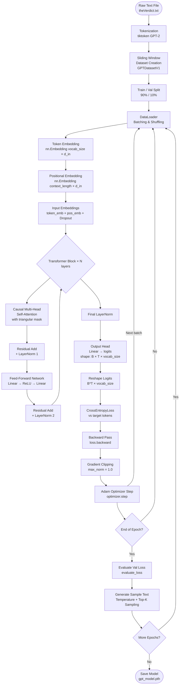

# GPT Training Flow

## Flowchart



---

## Step-by-Step Explanation

### 1. Raw Text Input
The training corpus is a plain text file (`theVerdict.txt`). This is the only data source the model learns from. All subsequent steps transform this raw text into something the model can consume.

---

### 2. Tokenization — `tiktoken` GPT-2
```python
tokenizer = tiktoken.get_encoding('gpt2')
token_ids = tokenizer.encode(text, allowed_special={"<|endoftext|>"})
```
The raw string is converted into a sequence of **integer token IDs** using OpenAI's `tiktoken` library with the GPT-2 vocabulary (50,257 tokens). Each word or sub-word piece maps to a unique integer. This is the bridge between human-readable text and the numerical world of tensors.

---

### 3. Sliding Window Dataset — `GPTDatasetV1`
```python
for i in range(0, len(token_ids) - max_length, stride):
    input_chunk  = token_ids[i : i + max_length]
    target_chunk = token_ids[i+1 : i + max_length + 1]
```
A **sliding window** of size `context_length` (100 tokens here) scans over the token sequence with a given `stride`. Each window produces one training sample:
- **Input**: tokens at positions `i … i+T-1`
- **Target**: tokens at positions `i+1 … i+T` (shifted one step right)

This encodes the language modelling objective: *predict the next token at every position*.

---

### 4. Train / Val Split
```python
val_size  = max(1, int(0.1 * dataset_size))
train_size = dataset_size - val_size
train_dataset, val_dataset = random_split(full_dataset, [train_size, val_size])
```
The dataset is split **90 % training / 10 % validation** using a fixed random seed for reproducibility. The validation set is never used for gradient updates — only to measure generalisation.

---

### 5. DataLoader — Batching & Shuffling
```python
train_dataloader = DataLoader(train_dataset, batch_size=32, shuffle=True)
```
PyTorch's `DataLoader` groups samples into **mini-batches** (size 32) and shuffles them each epoch to break correlations between consecutive samples.

---

### 6. Token Embedding
```python
self.token_embedding = nn.Embedding(vocab_size, d_in)   # 50257 × 768
token_emb = self.token_embedding(x)                     # B × T → B × T × 768
```
Each integer token ID is looked up in a learnable **embedding matrix**, projecting it into a dense 768-dimensional vector. This is how discrete tokens gain continuous semantic meaning.

---

### 7. Positional Embedding
```python
self.pos_embedding = nn.Embedding(context_length, d_in)  # 100 × 768
pos_emb = self.pos_embedding(torch.arange(seq_len))       # T × 768
```
Attention is **permutation-invariant** by itself — it cannot distinguish order. A separate learnable positional embedding (one vector per position slot) is added to inject sequence order information.

---

### 8. Combined Input Embeddings
```python
x = token_emb + pos_emb   # B × T × 768
x = self.dropout(x)
```
Token and positional embeddings are **summed element-wise**, then dropout is applied for regularisation. This combined tensor is the actual input to the stack of Transformer blocks.

---

### 9. Causal Multi-Head Self-Attention
```python
causal_mask = torch.triu(torch.ones(T, T, dtype=torch.bool), diagonal=1)
attn_out, _ = self.attention(x, x, x, attn_mask=causal_mask)
```
This is the core of the Transformer. Each token attends to **all tokens before it** (and itself), but not to future tokens — enforced by the upper-triangular causal mask which sets future positions to `-inf` before softmax.

With 12 heads, the model learns 12 different attention patterns in parallel, each focusing on different aspects of the context (syntax, co-reference, proximity, etc.).

---

### 10. Residual Add + LayerNorm 1
```python
x = x + self.dropout(attn_out)
x = self.norm1(x)
```
The **residual (skip) connection** adds the original input back to the attention output. This enables gradient flow through deep networks and lets earlier layers be bypassed if unneeded. `LayerNorm` then re-centres and re-scales the activations to stabilise training.

---

### 11. Feed-Forward Network
```python
self.ff = nn.Sequential(
    nn.Linear(d_out, d_ff),   # 768 → 3072
    nn.ReLU(),
    nn.Linear(d_ff, d_out),   # 3072 → 768
)
```
A position-wise two-layer MLP applied **identically to every token position**. The inner dimension expands to 4× the model dimension (`d_ff = 3072`), giving the model extra capacity to transform representations. This is where much of the model's "knowledge storage" happens.

---

### 12. Residual Add + LayerNorm 2
```python
x = x + self.dropout(ff_out)
x = self.norm2(x)
```
Same pattern as step 10 — residual connection plus layer normalisation after the feed-forward block. The output is fed into the next Transformer block.

Steps 9–12 repeat for **N = 12 layers**. Deeper layers build increasingly abstract representations.

---

### 13. Final LayerNorm
```python
x = self.final_norm(x)   # B × T × 768
```
After all Transformer blocks, one final normalisation stabilises the representations before the output projection.

---

### 14. Output Head (Logits)
```python
logits = self.output_head(x)   # B × T × 50257
```
A single linear layer (no activation) projects each 768-dim token representation to a **50,257-dimensional vector of logits** — one score per vocabulary token. The highest score at each position is the model's "best guess" for the next token.

---

### 15. Reshape & CrossEntropyLoss
```python
logits_flat  = logits.view(b * seq_len, vocab_size)   # (B*T) × 50257
targets_flat = target_ids.view(b * seq_len)            # (B*T,)
loss = loss_fn(logits_flat, targets_flat)
```
The logits and targets are flattened across the batch and sequence dimensions so that `CrossEntropyLoss` treats each token prediction as an independent classification problem. Internally it applies `softmax` + negative log-likelihood:

$$\mathcal{L} = -\frac{1}{B \cdot T} \sum_{b,t} \log P(x_{t+1}^{(b)} \mid x_{\leq t}^{(b)})$$

A lower loss means the model assigns higher probability to the correct next token.

---

### 16. Backward Pass
```python
optimizer.zero_grad()
loss.backward()
```
PyTorch's autograd engine traverses the computation graph in reverse, computing $\frac{\partial \mathcal{L}}{\partial \theta}$ for every learnable parameter $\theta$ via the chain rule. `zero_grad()` clears stale gradients from the previous step first.

---

### 17. Gradient Clipping
```python
torch.nn.utils.clip_grad_norm_(model.parameters(), max_norm=1.0)
```
If the **global L2 norm** of all gradients exceeds 1.0, every gradient is scaled down proportionally. This prevents **exploding gradients** — a common instability in deep networks — without eliminating gradient signal entirely.

---

### 18. Adam Optimizer Step
```python
optimizer.step()   # Adam, lr = 1e-4
```
Adam maintains **per-parameter adaptive learning rates** using estimates of the first moment (mean gradient) and second moment (uncentered variance). This makes it much more effective than plain SGD for Transformer training. Each parameter is updated:

$$\theta \leftarrow \theta - \frac{\hat{m}_t}{\sqrt{\hat{v}_t} + \epsilon} \cdot \alpha$$

---

### 19. Validation Loss — `evaluate_loss`
```python
val_loss = evaluate_loss(model, val_dataloader, loss_fn, device)
```
At the end of every epoch the model is switched to `eval()` mode (disabling dropout) and the loss is computed on the held-out validation set **without gradient tracking**. This measures how well the model generalises beyond its training examples.

---

### 20. Sample Text Generation — `generate_sample_text`
```python
# Top-K sampling with temperature
top_logits, top_indices = torch.topk(next_token_logits, k=40)
probs = torch.softmax(top_logits / temperature, dim=-1)
next_token_id = top_indices.gather(-1, torch.multinomial(probs, 1))
```
After each epoch a sample is generated autoregressively from a fixed prompt:
- **Temperature** (`0.8`): divides logits before softmax — lower = more deterministic, higher = more random.
- **Top-K** (`40`): restricts sampling to only the 40 highest-probability tokens, preventing very unlikely tokens from being chosen.

This gives a qualitative view of how the model's language ability improves epoch by epoch.

---

### 21. Save Model
```python
torch.save(model.state_dict(), 'gpt_model.pth')
```
After all epochs finish, the learned weights (`state_dict`) are saved to disk. These can be loaded later for inference or fine-tuning without retraining from scratch.
